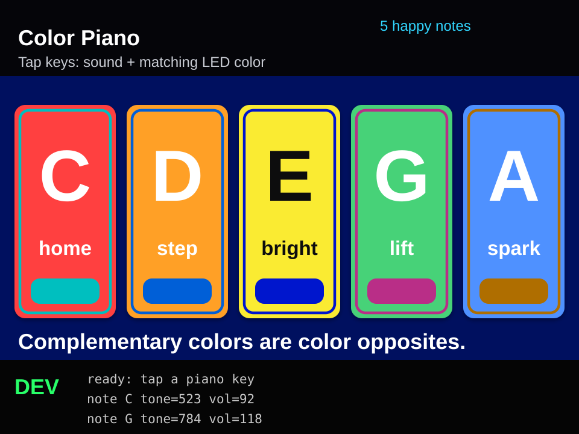

# CYD Kids Toy Piano

A five-key color piano for the ESP32 Cheap Yellow Display (CYD / ESP32-2432S028R).



## Features

- Five touch keys: C, D, E, G, A
- Rear RGB LED changes color for each key and keeps the last key color
- Separate LED color calibration for cleaner physical LED colors
- Speaker output through the CYD SPEAK connector on GPIO 26
- Touch pressure controls tone volume
- Small on-screen DEV log for touch and note events

## Hardware Assumptions

- ESP32-D0WD CYD with ILI9341 display
- XPT2046 touch controller
- Rear RGB LED on GPIO 4, 16, and 17
- Speaker amplifier input on GPIO 26

## Build And Flash

```sh
pio run -e cyd
pio run -e cyd -t upload
```
