# CYD Kids Toy Piano

A five-key color piano for the ESP32 Cheap Yellow Display (CYD / ESP32-2432S028R).

<picture>
  <source media="(prefers-reduced-motion: reduce)" srcset="docs/cyd-kids-toy-piano-still.svg">
  
</picture>

*Silent animated preview — watch the keys press and the rear RGB light follow each note, then hold its last color. Plays right here in the README; no clicks needed.*

## Features

- Five touch keys: C, D, E, G, A
- Clean full-screen piano UI with compact volume controls
- Rear RGB LED changes color for each key and keeps the last key color
- Separate LED color calibration for cleaner physical LED colors
- Speaker output through the CYD SPEAK connector on GPIO 26
- Starts quiet and supports fine volume steps under 10
- Touch pressure controls note volume within the master volume setting

## Hardware Assumptions

- ESP32-D0WD CYD with ILI9341 display
- XPT2046 touch controller
- Rear RGB LED on GPIO 4, 16, and 17
- Speaker amplifier input on GPIO 26

## Build And Flash

```sh
pio run -e cyd
pio run -e cyd -t upload
```

## Changelog

- Added compact on-screen `VOL - / +` controls.
- Changed startup volume to quiet mode (`VOL 4`).
- Added one-step volume control below 10 for finer low-volume tuning.
- Removed on-screen developer/debug notes and app serial debug logs.
- Enlarged the five piano keys to fill nearly the whole CYD screen.
